# CloudFaster Academy: Laboratório Serverless URL Shortener

> **Autor:** [CloudFaster Tecnologia](https://cloudfaster.com.br), **Última revisão:** 29/10/2022

## Introdução

Serviços *serveless*, além de nos proporcionar a criação de aplicações altamente disponíveis, nos permitem criar e implantar de forma rápida nossas aplicações, isso porque não precisamos nos preocupar com a infraestrutura que será necessária para que nossa aplicação seja executada, precisamos nos preocupar apenas com a lógica da aplicação, os recursos necessários serão provisionados pela AWS com apenas alguma configurações que podemos fazer diretamente na console da AWS, ou via AWS CLI.\
\
Neste laboratório iremos construir uma aplicação que será responsável por encurtar URLs para que possamos compartilhar com nossos amigos, clientes, familiares, etc. Nosso primeiro passo é pensar na arquitetura da nossa aplicação, saber quais serviços a AWS nos fornece que poderá nos auxiliar no desenvolvimento da aplicação. Abaixo temos um diagrama de como foi arquitetado nosso encurtador de URL e quais serviços utilizaremos.\
\
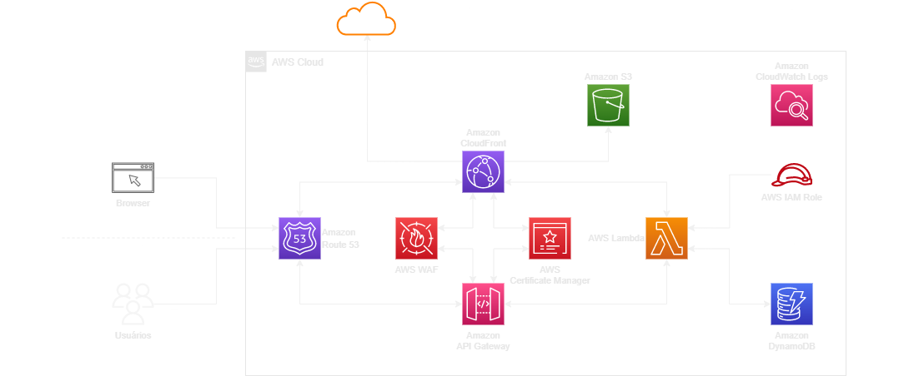
\
\
Para criar uma nova URL encurtada, o primeiro passo é informar para aplicação qual URL original e por quanto tempo a URL encurtada estará disponível. Assim, iremos realizar uma requisição via API através do *Amazon API Gateway*, essa API tem um endpoint que será traduzido pelo nosso serviço de DNS o *Amazon Route 53*. No corpo da requisição serão informados os dados necessários para encurtar a URL, como endereço original, tempo de vida da URL gerada e, opcionalmente, um nome personalizado para que seja o código da URL encurtada, isso fará com que em vez de ser gerado um código aleatório para passar como *path parameter*, seja utilizado um nome definido (Ex: <https://lab-academy.cf/aws>). A *API Gateway* irá acionar uma função do *AWS Lambda* que executará o código da aplicação e armazenará o resultado em uma tabela do *Amazon DynamoDB* e retornará o resultado para o requisitante.\
\
Agora com a URL na mão, atravéz de um Browser qualquer, poderemos digita-lo na barra de endereços, esse endereço será traduzido pelo *Amazon Route 53* e encaminhará a requisição para o *Amazon CloudFront*, que assim que recebe a requisição, dispara uma função do *AWS Lambda* que irá procurar o código informado na tabela do *Amazon DynamoDB* e retornará o endereço para onde o *Amazon CloudFront* irá realizar o redirecionamento. Esse endereço poderá ser uma URL externa ou até uma URL pré-assinada de um objeto em um Bucket do *Amazon S3*.\
\
Para adicionarmos uma camada de segurança para nossa aplicação, utilizaremos o *AWS WAF* para ser noss Web Application Firewall, e também adicionaremos um serviço de SSL para criptografia de dados em trânsito com o *AWS Certificate Manager*, esses serviços são interligados diretamente nos nossos serviços do *Amazon CloudFront* e *Amazon API Gateway*. Para que nossa função do *AWS Lambda* possa acessar outros serviços da AWS, adicionamos uma função do *AWS IAM Role*. E, finalmente, para analisar tudo que acontece na nossa aplicação, temos o *Amazon CloudWatch Logs* que armazenará todos os LOGS gerados pela aplicação.

## Hands-on

Neste laboratório você aprenderá como criar uma *role* (função) do *AWS IAM Role*, configurar criar uma função do *AWS Lambda*, criar uma API no *Amazon API Gateway* e vincular uma função Lambda, configurar um certificado SSL com o *AWS Certificate Manager*, criar um endpoint customizado da API Gateway, criar uma tabela no *Amazon DynamoDB*, criar uma distribuição do *Amazon CloudFront*, vincular o *AWS WAF* ao CloudFront e API Gateway e por fim, como manipular registros DNS no *Amazon Route 53*.

### Pré-requisitos

1) Uma conta na AWS.
2) Um usuário com permissões suficientes para acessar os recursos necessários (IAM, Route 53, Lambda, DynamoDB e API Gateway, ACM e CloudFront).
3) Um DNS já pré-configurado no *Amazon Route 53*.

> **Importante:** O domínio deve ser registrado com antecedencia no *Amazon Route 53*, já que a propagação dos *Names Servers* podem levar até 24h.

### Passo 1: Criar uma Role do IAM

Após acessar sua conta AWS, navegue até o serviço *AWS IAM Roles* ou acesse diretamente por esse link: <https://console.aws.amazon.com/iamv2/#/roles>.\
Clique no botão `Create role`.\
\
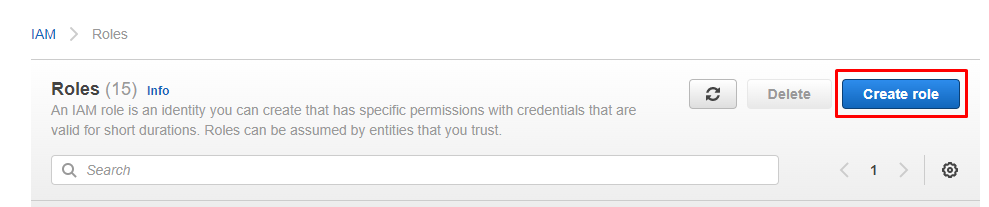
\
\
Na próxima tela, selecione o tipo de entidade confiável `AWS service`, selecione o caso de usos `Lambda` e clique em `Next`.\
\
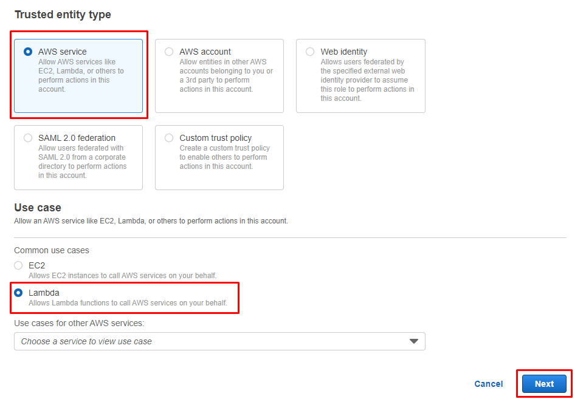
\
\
Na tela seguinte, adicione as permissões (*policies*) necessárias para que nossas funções Lambda tenham acesso aos serviços necessários. Adicione as seguintes *policies*:

* AWSLambdaBasicExecutionRole
* AmazonDynamoDBFullAccess
* AmazonS3FullAccess

> **Atenção:** Não é aconselhavel utilizar uma IAM Policy de Full Access. Seguindo as boas práticas de segurança, é sempre recomendável utilizar permissões granulares com o menor privilégio. Utilizaremos essa IAM Policy apenas para fins didáticos.

Ao finalizar, clique em `Next`.\
\
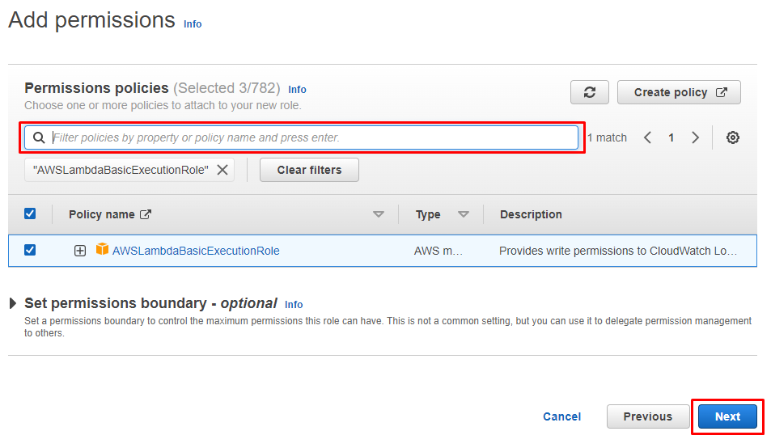
\
\
Dê um nome para sua *IAM Role*, para fins de exemplo utilizarei "role-lab-urlshortener", revise os dados e em seguida clique em `Create role`.\
\

\
\
Agora precisamos, definir a relação de confiança da Role recem criada para que ela funcione com o Lambda@Edge, acesse a Role, e em `Trust relationships` clique em `Edit trust policy`.\
\
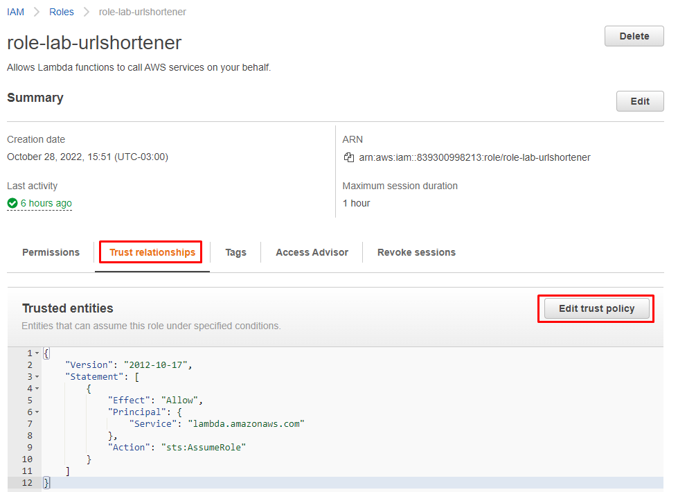
\
\
No editor que será aberto, informe o seguinte JSON, ele garantirá as relações de confiança necessárias para que nossa aplicação funcione perfeitamente. Ao finalizar clique em `Update policy`.

```json
{
  "Version": "2012-10-17",
  "Statement": [
    {
      "Effect": "Allow",
      "Principal": {
        "Service": [
          "lambda.amazonaws.com",
          "edgelambda.amazonaws.com"
        ]
      },
      "Action": "sts:AssumeRole"
    }
  ]
}
```

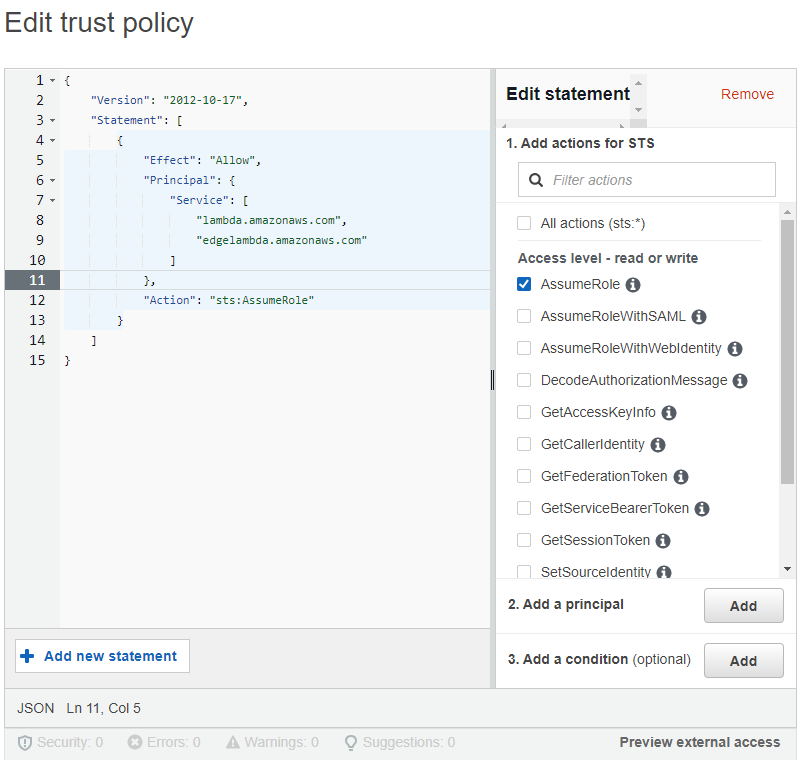

Pronto sua IAM Role, está criada e pronta para ser anexada à sua função Lambda, podemos seguir para o passo 2.

### Passo 2: Criar a tabela no DynamoDB

Após acessar sua conta AWS, navegue até o serviço *Amazon DynamoDB* ou acesse diretamente por esse link: <https://console.aws.amazon.com/dynamodbv2/#tables>.\
\
No dashboard do serviço, procure e clique no botão `Create table`.\
\
Na tela de criação da tabela, dê um nome para nossa tabela, para fins de exemplo utilizarei "lab-urlshortener", e informe uma partition key, para nosso exemplo utilizarei `id`.\
\
Mantenha o restante das configurações conforme sugerido e clique, no final da página, em `Create table`.

> **Atenção:** Verifique qual a região da AWS você criou a tabela, pois precisaremos dessa informação para que nosso Lambda possa acessar o serviço.

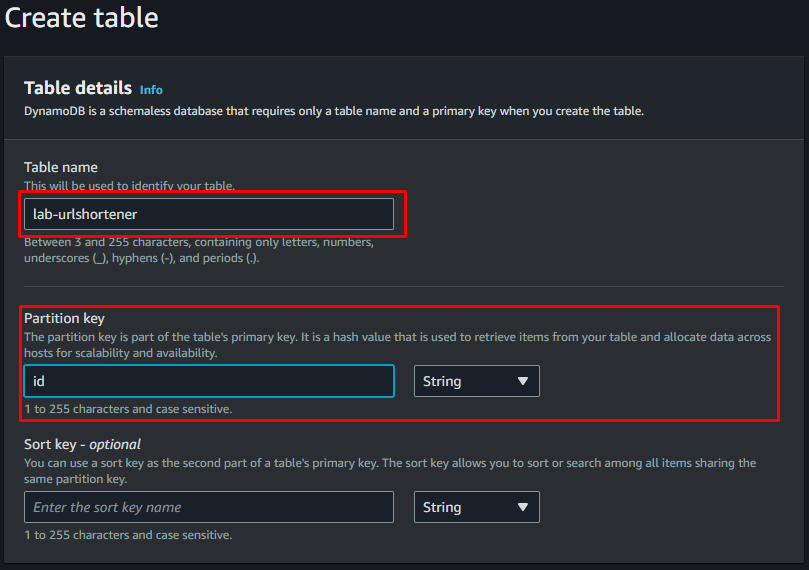
\
\
Aguarde a criação da tabela, pode levar alguns segundos até que ela esteja disponível.\
\
Assim que a tabela estiver disponível, na lista de tabelas, clique sobre o nome da tabela recem criada para editarmos suas configurações.\
\
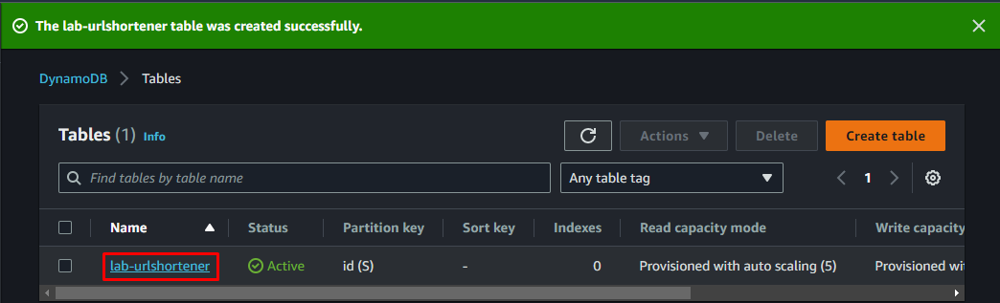
\
\
Na próxima tela, clique em `Additional settings`.\
\
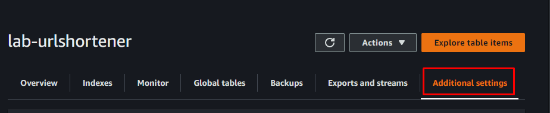
\
\
Role a tela para baixo, em *Time to Live (TTL)* clique no botão `Enable`.\
\
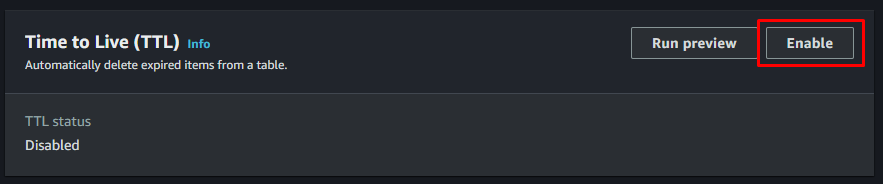
\
\
Na tela de configuração do Time to Live, informe o nome do atributo que conterá o timestamp na tabela, em nosso caso "dataExclusao", em seguida clique em `Enable TTL`.

> **Importante:** Esse passo é necessário para garantir que, caso informado um período de duração da URL encurtada, ela seja excluida automaticamente da nossa base de dados, o próprio DynamoDB cuidará da exclusão sem precisarmos nos preocupar.

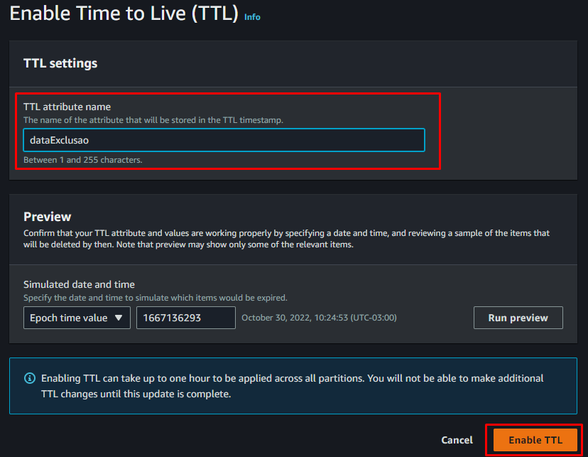
\
\
Pronto, nossa tabela do DynamoDB já está criada e configurada para receber os dados da nossa aplicação, podemos seguir para o passo 3.

### Passo 3: Criar a função Lambda que irá gerar a URL encurtada

Após acessar sua conta AWS, navegue até o serviço *AWS Lambda* ou acesse diretamente por esse link: <https://console.aws.amazon.com/lambda>.\
\
Na tela do serviço será listado todas as funções lambdas disponíveis para a região selecionada e teremos um botão `Create Function` no canto superiror direito da listagem, clique nele.\
\
Na tela seguinte, mantenha a opção `Author from scratch` selecionada, informe um nome para sua função, para nosso exemplo utilizarei "lambda-generate-url-shortener", em seguida escolha um *Runtime* e a arquitetura que você quer que seu código seja executado, para esse exemplo utilizaremos Python 3.9 em uma arquitetura x86_64.\
\
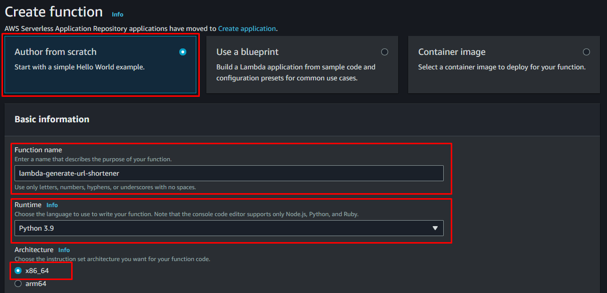
\
\
Desça a tela um pouco e abra as opões presentes em `Change default execution role`, marque a opção `Use an existing role` e no campo `Existing role` selecione a *IAM Role* criada no passo 1, em seguida, clique em `Create Function`.\
\
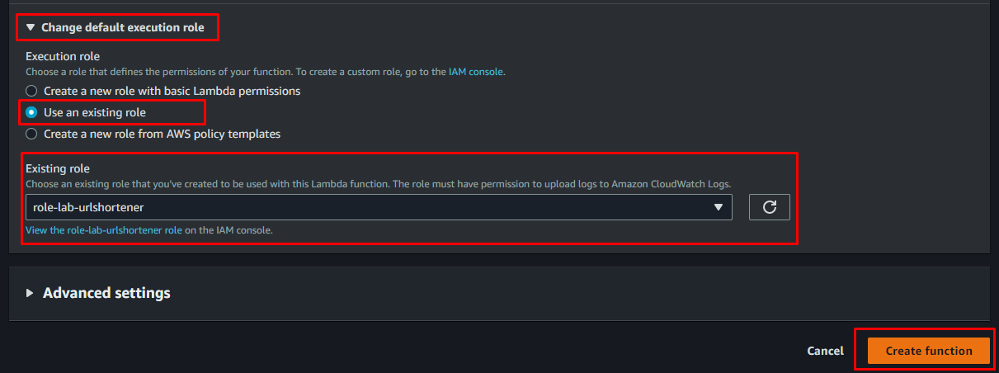
\
\
Sua função Lambda será criada e será possível editar o código diretamente no *Browser*.\
\
Apague o conteúdo do arquivo "lambda_function.py" aberto no editor de código da função Lambda, copie todo o conteúdo do arquivo [`lambdas/lambda-generate-url-shortener.py`](https://github.com/cloudfaster-academy-workshop/lab-url-shortener/blob/main/lambdas/lambda-generate-url-shortener.py), disponível neste repositório, e cole no editor de código da função Lambda.\
\
Em seguida substitua as variáveis `DYNAMODB_TABLE`, `AWS_REGION` e `APP_DOMAIN` (linhas 11, 13 e 15 do código) com os valores corretos para sua tabela do DynamoDB criado no passo 2 e também com os dados do domínio que você recebeu para este laboratório.\
\
Ao finalizar clique em `Deploy`.\
\
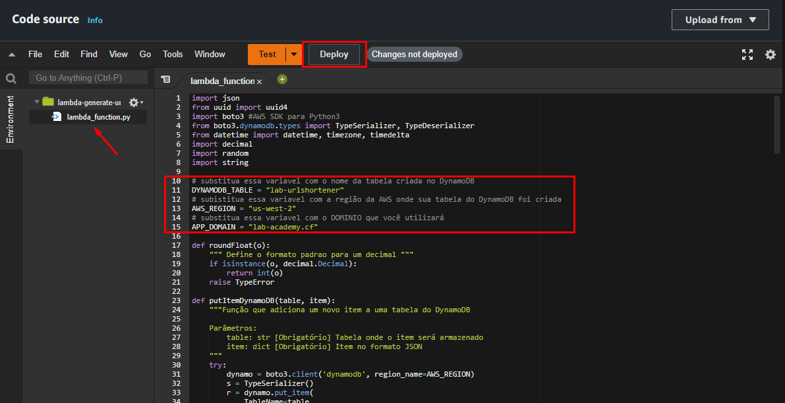
\
\
Agora iremos testar nossa nova função Lambda, clique em `Test`. Será aberta uma tela de configuração do evento, nele iremos informar um nome para nosso teste e o Event JSON que será recebido como evento. Nesse JSON iremos informar os dados necessário para gerar a URL encurtada, como "url", "ttl" e "alias".

> **Importante:** O único campo obrigatório da nossa função é o campo "url". Os campos "ttl" e "alias" são opcionais, nesse exemplo utilizaremos apenas para demonstração.

```json
{
    "url": "https://aws.amazon.com/pt/",
    "ttl": 300,
    "alias": "aws"
}
```

Ao finalizar, clique em `Save`.\
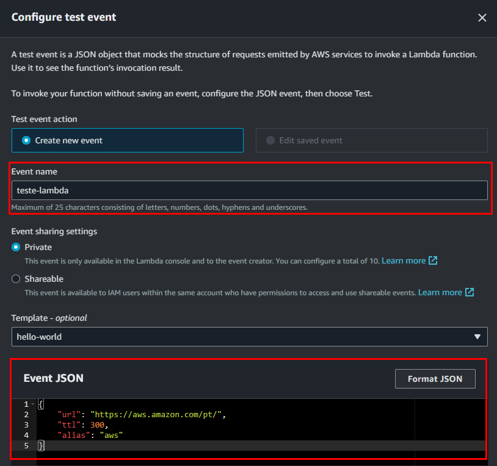
\
\
Assim que o novo evento de teste for criado, você poderá rodar sua função Lambda para teste, basta clicar no botão `Test` novamente.\
\
Tudo ocorrendo bem você verá uma mensagem de sucesso, conforme imagem abaixo:\
\
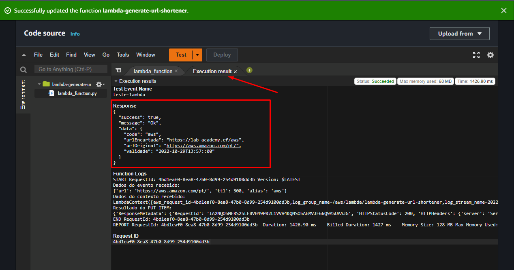
\
\
Você pode verificar se tudo ocorreu bem acessando a tabela do DynamoDB, através do seguinte link <https://console.aws.amazon.com/dynamodbv2/>, acessando o menu `Explore items` e selecionando a tabela recém criada, lá você poderá visualizar se o dado foi adicionado corretamente.\
\
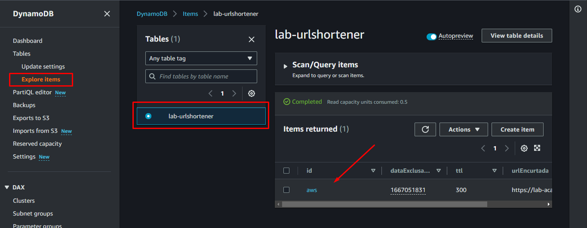
\
\
Nossa função lambda já está OK, vamos agora vinculá-la a API Gateway no passo 4.

### Passo 4: Criar o vínculo do Lambda com a API Gateway

Após acessar sua conta AWS, navegue até o serviço "Api Gateway" ou acesse diretamente por esse link: <https://console.aws.amazon.com/apigateway>.\
\
Na tela do serviço, procure pela opção `REST API` e clique em `Build`. Na tela que será aberta aparecerá um pop-up de boas-vindas, clique em OK.\
\
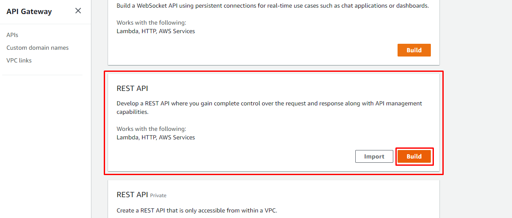
\
\
Informe o protocolo da sua nova API, `REST`, informe que você deseja criar uma nova API selecionando `New API`, informe um nome para sua API compo por exemplo: "lambda-urlshortener-integration" e em seguida clique em `Create API`.\
\
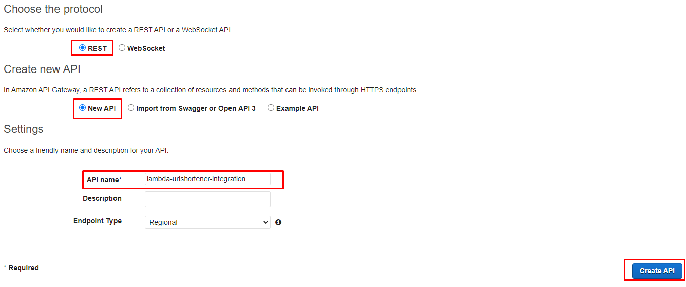
\
\
Na próxima tela, clique em `Actions` e em seguida `Create Method` aparecerá um campo seletor, selecione o método POST e clique no simbolo de "check".\
\
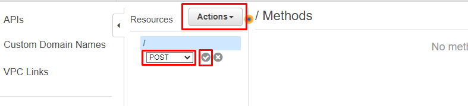
\
\
Configure seu Lambda criado no passo 3 como integração da API Gateway, marcando o tipo de integração como `Lambda Function`, selecione a região onde seu Lambda foi criado e informe o nome da função Lambda criada, em seguida clique em `Save`.\
\
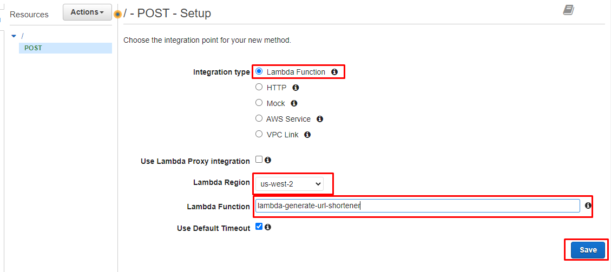
\
\
Um pop-up de verificação aparecerá perguntando se você tem certeza que deseja dar permissão para a API Gateway de invocar a Função Lambda, clique em `OK`.\
\
Após criado o método, vamos configurar o CORS da API, nesse caso vamos liberar o CORS para qualquer origem, basta acessar o botão `Actions` e em seguida `Enable CORS`.\
\
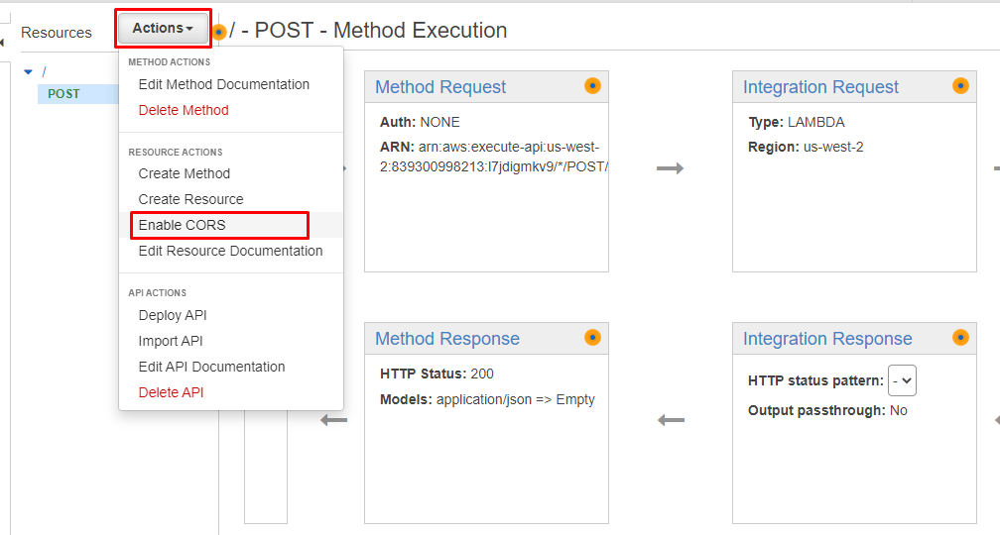
\
\
Na próxima tela, revise dos dados da configuração do CORS e clique em `Enable CORS and replace existign CORS headers`.\
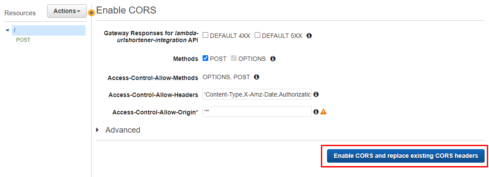
\
\
Um pop-up surgirá para confirmar as alterações, clique em `Yes, replace existing values`.\
\
Finalizado essa parte, nossa API já está pronta para ser implantada, para isso vamos acessar novamente o botão `Actions` e em seguida `Deploy API`, um pop-up com os detalhes da implantação irá aparecer, se nenhum estágio da API tiver sido criado antes, vai aparecer uma opção de [New Stage] para `Deployment stage` e pedirá o nome do estágio, para testes informe "test", em seguida clique em `Deploy`.\
\
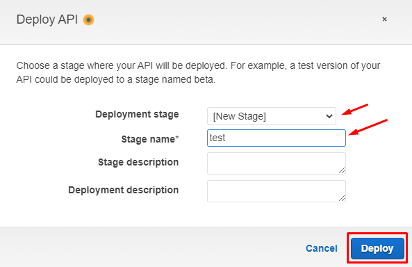
\
\
Pronto, sua API está implantada e pronta para receber as requisições. Em `Stages` você consegue visualizar o endpoint que você pode utilizar para suas requisições.\
\
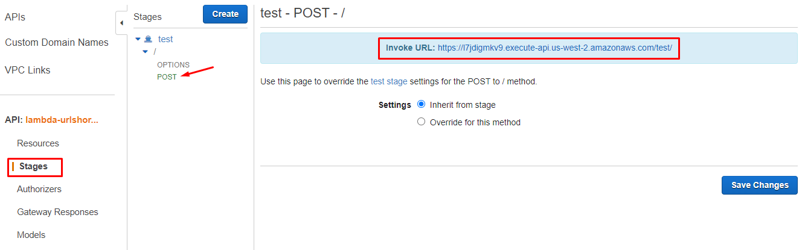
\
\
Para testar, você pode utilizar o PostMan para realizar suas resquisições, e em seguida verificar no DynamoDB se os dados foram inseridos corretamente. Você pode utilizar o JSON abaixo para fins de teste.

```json
{
    "url": "https://cloudfaster.com.br/blog/dicas-para-aprovacao-no-exame-aws-certified-cloud-practitioner"
}
```

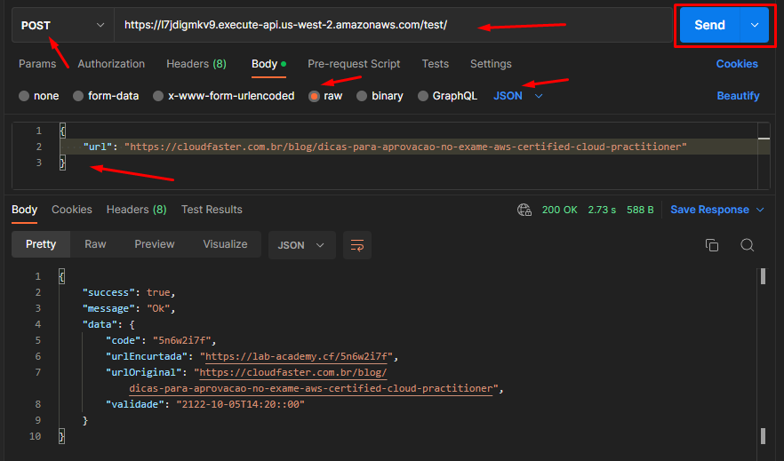\
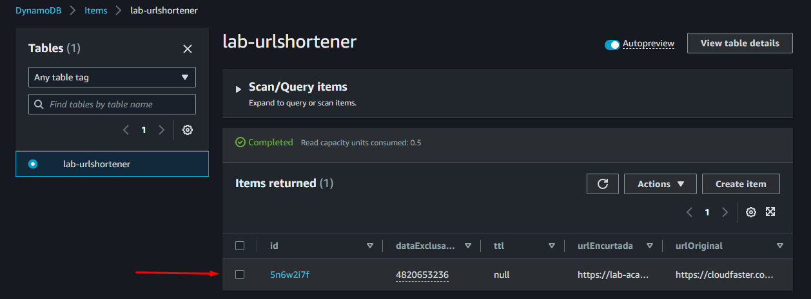

> **Nota:** É possível que ao visualizar os dados do DynamoDB novamente, nosso teste anterior não esteja mais na tabela, isso porque utilizamos um TTL de 300 segundos (5 minutos) e o tempo de vida do dado pode ter chegado ao fim e o DynamoDB removido automaticamente.

Guarde o resultado desse teste, utilizaremos na última etapa para validar se tudo ocorreu bem.\
\
A primeira parte do nosso encurtador de URL já está pronta, já é possível receber uma URL original, tranforma-la em uma URL curta, mas agora é preciso criar uma função que fará esse redirecionamento, veremos isso no passo 5.

### Passo 5: Criando a função Lambda que fará o redirecionamento da URL

Aqui criaremos uma função Lambda que fará o redirecionamento da URL encurtada para a URL original.\
\
Para criação do Lambda, basta seguir o [passo 3](https://github.com/cloudfaster-academy-workshop/lab-url-shortener#passo-3-criar-a-fun%C3%A7%C3%A3o-lambda-que-ir%C3%A1-gerar-a-url-encurtada) até o momento de adicionar o código diretamente no *Browser*.\
\
Nessa outra função Lambda, utilizaremos nosso segundo código lambda que terá o nome "lambda-redirect-url", lembre-se de utilizar esse nome no momento de criar a função Lambda, e depois utilize o arquivo [`lambdas/lambda-redirect-url.py`](https://github.com/cloudfaster-academy-workshop/lab-url-shortener/blob/main/lambdas/lambda-redirect-url.py), disponível neste repositório, cole-o no editor de código da função Lambda.\
\
Substitua as variáveis `DYNAMODB_TABLE` e `AWS_REGION` (linhas 9 e 11 do código) com os valores corretos para sua tabela do DynamoDB criado no passo 2. Ao finalizar clique em `Deploy`.\
\
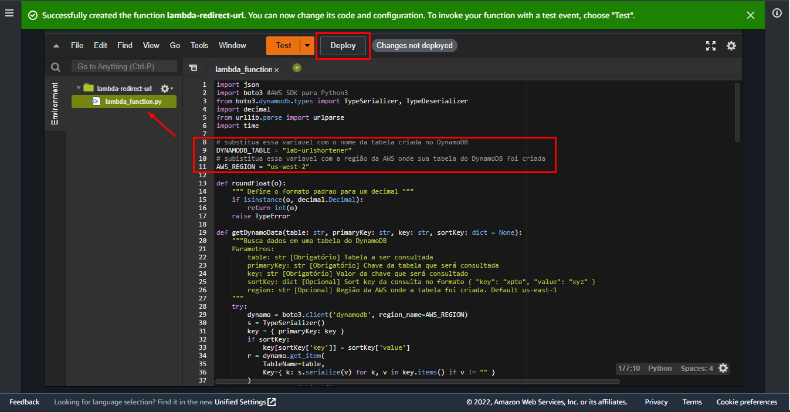
\
\
Nossa segunda função Lambda está pronta para ser adicionada ao evento do *Amazon CloudFront*, e faremos isso no passo 6.

### Passo 6: Vinculando uma função Lambda com o CloudFront via Lambda@Edge

Nesse passo iremos aprender como criar um Lambda@Edge e vinculá-lo ao CloudFront. Para que nosso CloudFront funcione como o esperado, precisaremos criar um Bucket S3, para ser nossa origem dos dados, em seguida precisaremos configurar um certificado SSL para nosso domínio com o AWS Certificate Manager e pra funcionar precisaremos fazer uma configuração no DNS através do Route 53.\
\
Primeiramente é necessário criarmos nossa distribuição CloudFront para servir um conteúdo estático, para isso criaremos um Bucket no S3 para ser nossa origem dos dados.\
\
Após acessar sua conta AWS, navegue até o serviço "S3" ou acesse diretamente por esse link: <https://s3.console.aws.amazon.com/s3/buckets>.\
\
Serão listados os buckets S3 disponíveis em sua conta AWS, clique no botão `Create bucket` para adicionar um novo Bucket S3.\
\
Na tela de criação do Bucket, defina um nome para seu Bucket S3, para esse exemplo utilizarei o nome "lab-urlshortener". Mantenha as demais configurações com os valores padrão e no final da página clique em `Create bucket`.

> **Atenção:** Os nomes dos Buckets S3 devem ser únicos em toda a nuvem, caso escolha um nome que já exista uma mensagem de erro será apresentada.

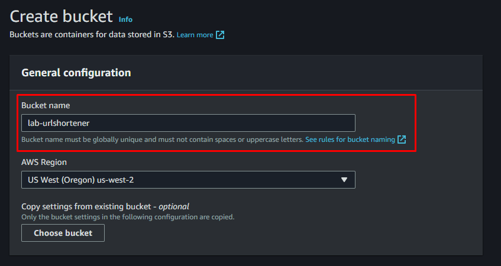
\
\
Agora iremos configurar nosso certificado SSL, navegue até o serviço "ACM" ou acesse diretamente por esse link: <https://console.aws.amazon.com/acm/#/welcome>.\
\
Clique no botão `Request a certificate`, na próxima tela, selecione a opção `Request a public certificate` e depois em `Next`.\
\
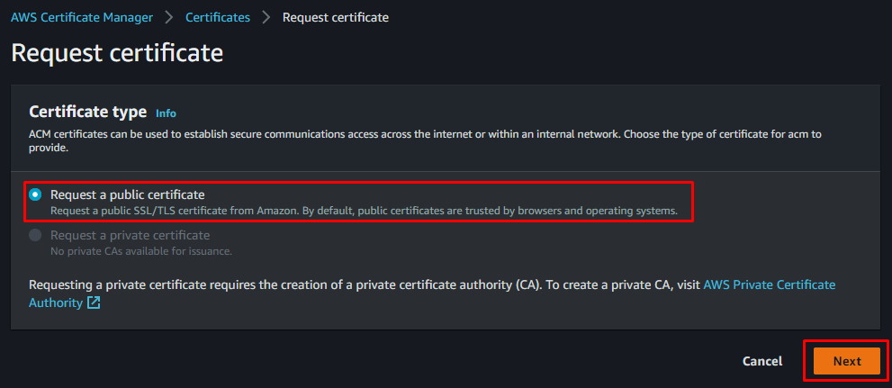
\
\
Na próxima tela, adicione o dominio/subdomínio que será assinado pelo certificado. Iremos adicionar o domínio gerado para você e também um "wildcard" no formato `*.meudominio.cf`. Primeiro adicione seu domínio, depois clique no botão `Add another name to this certificate` e adicione o "wildcard". Mantenha a opção `DNS validation  - recommended` selecionado e clique em `Request`.\
\
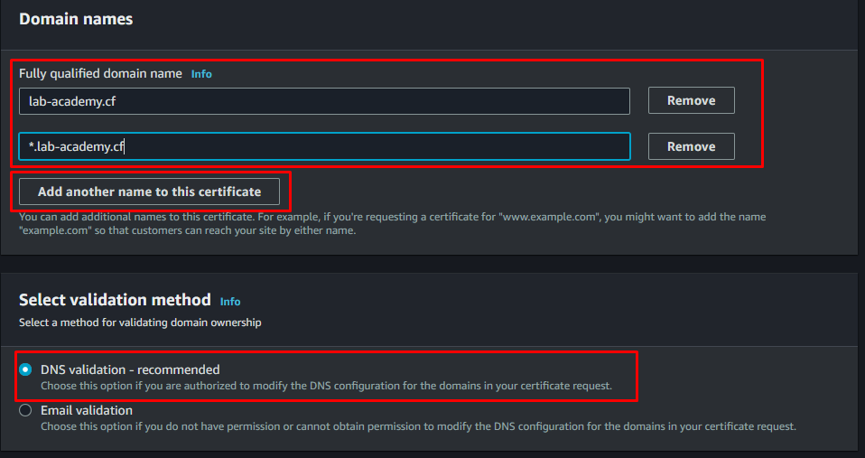
\
\
Você será redirecionado para a listagem de certificados disponíveis, caso seu certificado não apareça, basta clicar no botão de "Refresh". Note que ele estará com o status "Pending validation". Clique sobre o identificador do certificado criado para visualizarmos o status e também os domínios.
\
Na próxima tela, será possível visualizar os dados de configuração que devemos colocar em nosso serviço de DNS, como estamos utilizando o Route 53, temos um botão que já faz toda a configuração para a gente, basta clicar em `Create records in Route 53`\.
\
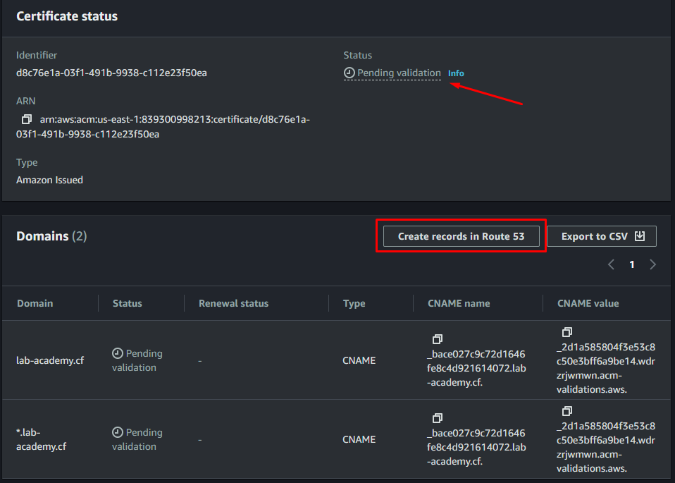
\
\
Será aberta uma tela para confirmar a criação dos registros no Route 53, clique em `Create records`.\
\
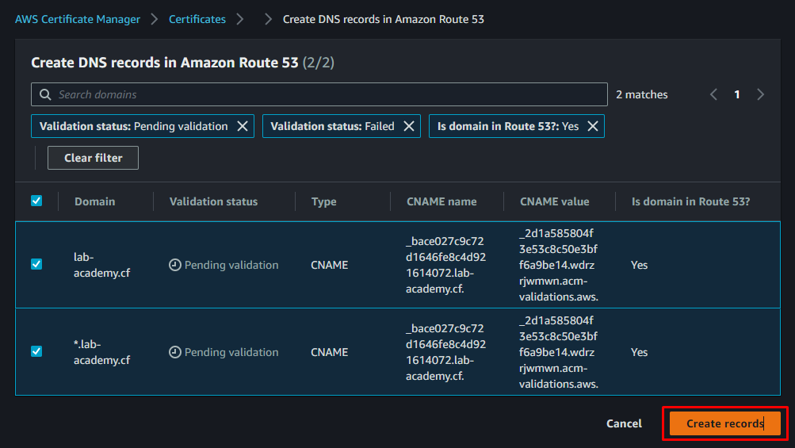
\
\
Você será redirecionado de volta para a tela de status do certificado, aguarde alguns minutos até que o DNS seja propagado, geralmente é bem rápido. Recarreque a página de tempos em tempos para verificar se o certificado já foi publicado.\
\
Assim que o processo de propagação for finalizado, será possível ver que o certificado esta publicado.\
\

\
Pronto, nosso certificaso SSL já está pronto para vincularmos à nossa distribuição do CloudFront.\
\
Agora iremos criar uma distribuição do CloudFront para servir esse Bucket S3. Navegue até o serviço "CloudFront" ou acesse diretamente por esse link: <https://console.aws.amazon.com/cloudfront/v3/#/distributions>.\
\
Na tela do serviço, clique no botão `Create distribution`.\
\
Na próxima tela iremos configurar qual será nossa origem dos dados, ou seja, quais dados serão distribuídos pelo CloudFront.\
\
Em `Orign domain`, selecione o Bucket S3 recém criado, em `Origin path` pode manter vazio, o campo `Name` será preenchido automaticamente com o nome do Bucket, mantenha o nome ou escolha um de sua preferência.\
\
Em `Origin access`, iremos configurar as permissões necessárias para acessar nossos objetos no S3, para isso selecione a opção `Legacy access identities`.\
\
Novas opções serão exibidas, em `Origin access identity`, clique no botão `Create new OAI`, um pop-up será exibido para que você informe um nome, mantenha o nome sugerido ou crie um de sua preferência.\
\
Em `Bucket policy`, selecione a opção `Yes, update the bucket policy`.\
\
Mantenha os demais campos do grupo `Origin` com os valores já definidos.\
\
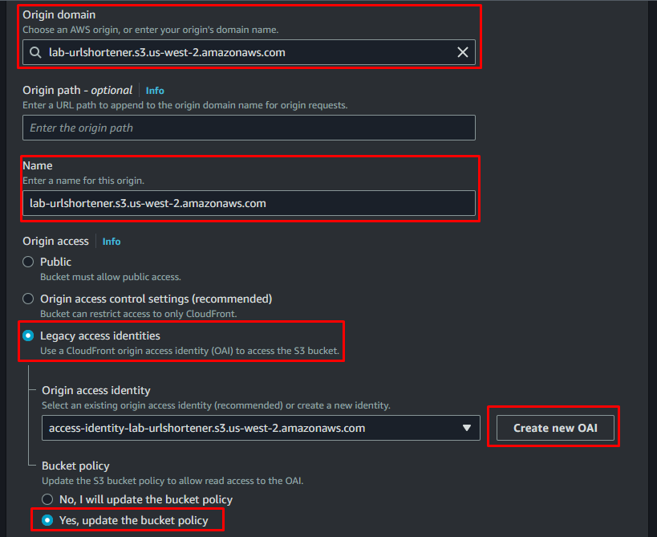
\
\
Em `Default cache behavior`, em `Viewer protocol policy`, selecione a opção `Redirect HTTP to HTTPS` e mantenha os demais campos do grupo com os valores já definidos.\
\
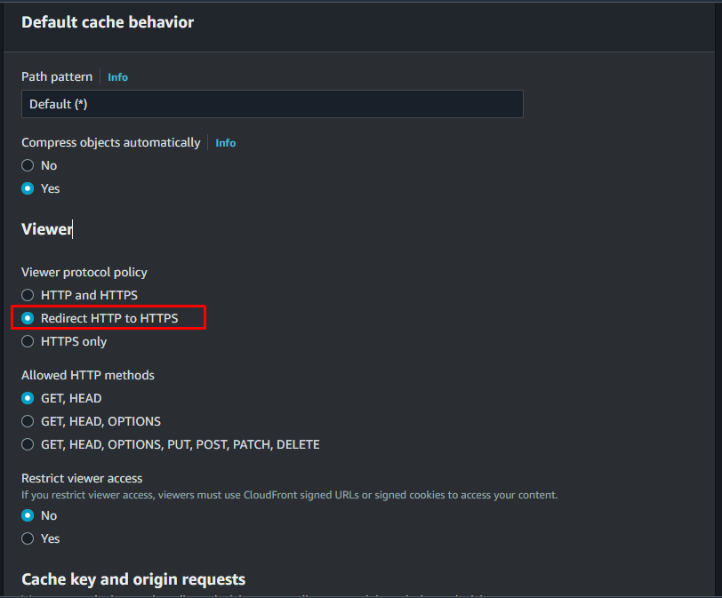
\
\
Em `Settings`, no campo `Alternative domain name (CNAME) - optional` clique no botão `Add item` e informe o domínio desejado. No campo `Custom SSL certificate - optional` selecione o certificado SSL que acabamos de criar.\
\
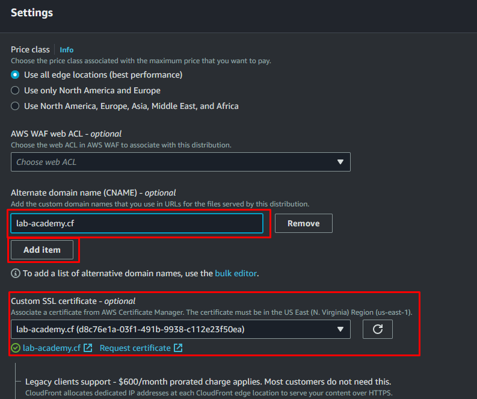
\
\
Ainda no campo `Settings` um pouco mais pra baixo na tela, no campo `Default root object`, informe o nome do arquivo que deverá ser o default do diretório root, em nosso caso informe `index.html`. Em seguida clique em `Create distribution`.\
\
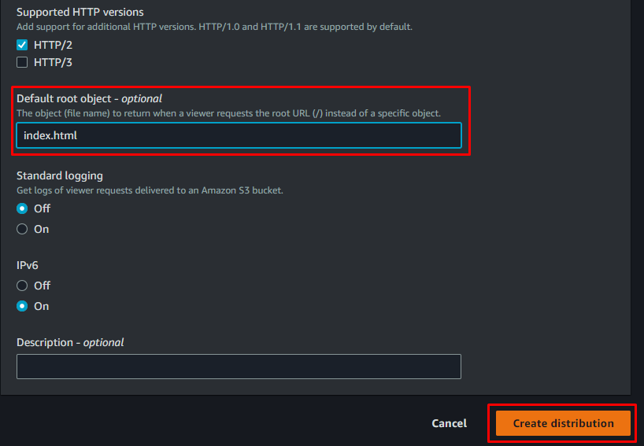
\
\
Ao finalizar, uma tela informando que a distribuição foi criada será exibida, bem como o identificador da distribuição, DNS e também informará que a distribuição está sendo implantada. Guarde o identificador e copie o DNS, pois precisaremos dele para criarmos nossa rota do DNS.\
\
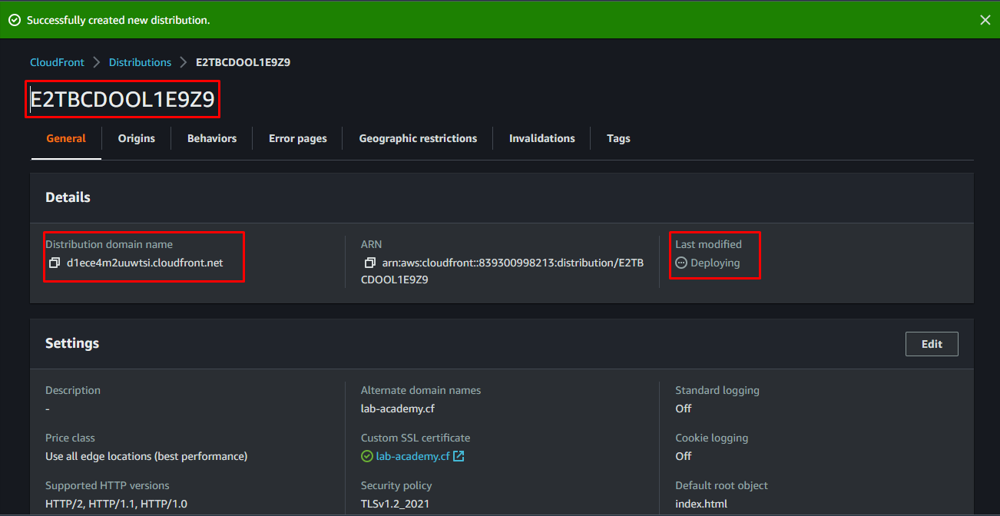
\
\
Agora iremos fazer o vinculo do CloudFront com o Lambda, navegue até o serviço *AWS Lambda* ou acesse diretamente por esse link: <https://console.aws.amazon.com/lambda>.\
\
Procure pela função que criamos no passo 5, no nosso caso "lambda-redirect-url.py" e clique nele. Nossa função Lambda será aberta e teremos um botão `Add trigger` clique nele.\
\
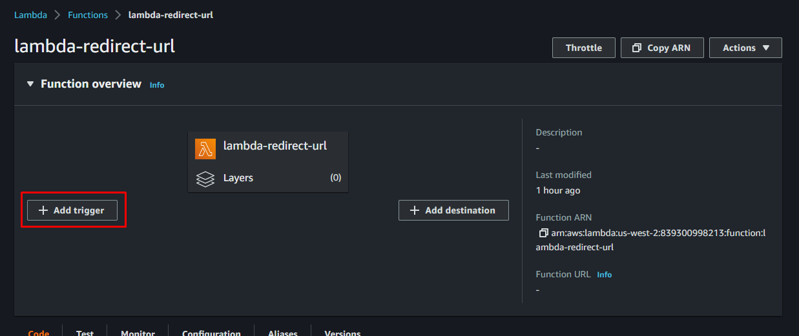
\
\
Uma tela de configuração será aberta, em `Trigger configuration`, em `Select a source`, selecione `CloudFront`, um botão `Deploy to Lambda@Edge` será exibido, clique nele.\
\
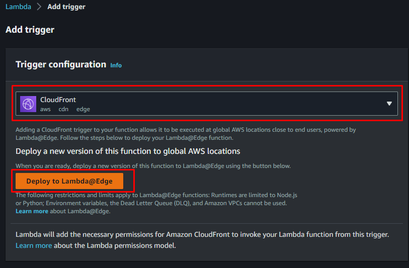
\
\
Na tela de Deploy do Lambda@Edge, selecione a opção `Configure new CloudFront trigger`, no campo `Distribution` selecione a distribuição do CloudFront recém criada, localize-a através do Identificador que foi gerado, em `Cache behavior` selecione a única opção disponível "*", em `CloudFront event` mantenha a seleção em `Origin request`, marque as opções `Include body` e `Confirm deploy to Lambda@Edge` e depois clique em `Deploy`.\
\
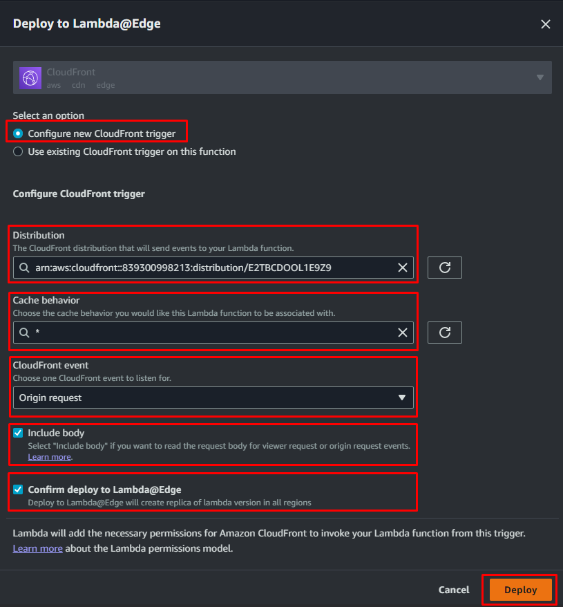
\
\
Tudo dando certo, uma tela de confirmação deverá aparecer conforme imagem abaixo.\
\
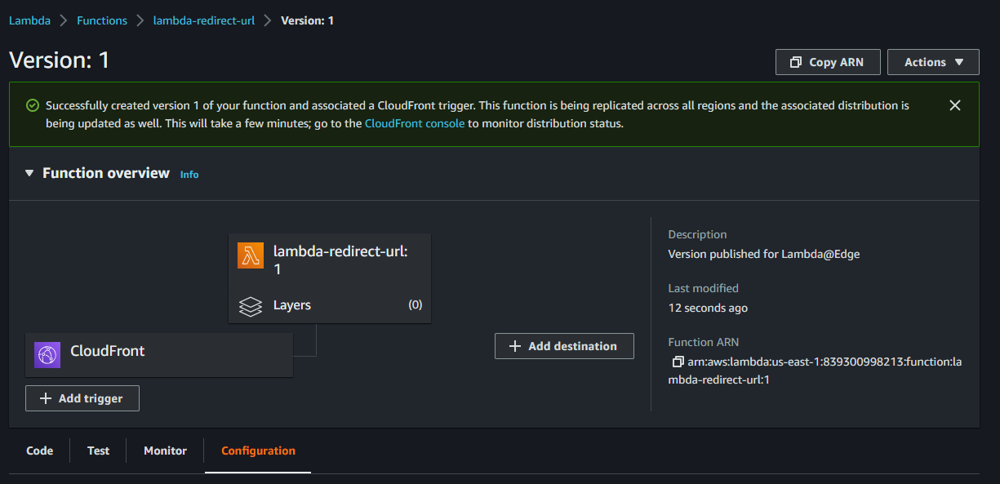
\
\
Pronto nosso vínculo do Lambda com o CloudFront está feito, agora só resta configurar o DNS no Route 53, que veremos no passo 7.

### Passo 7: Configuração do DNS no Route 53

Nesse passo veremos como criar um registro do nosso DNS que irá apontar para o serviço do CloudFront.\
\
Após acessar sua conta AWS, navegue até o serviço "S3" ou acesse diretamente por esse link: <https://console.aws.amazon.com/route53/v2/hostedzones>.\
\
Clique no seu domínio para abrir os registros de DNS, na tela que será aberta clique no botão `Create record`.\
\
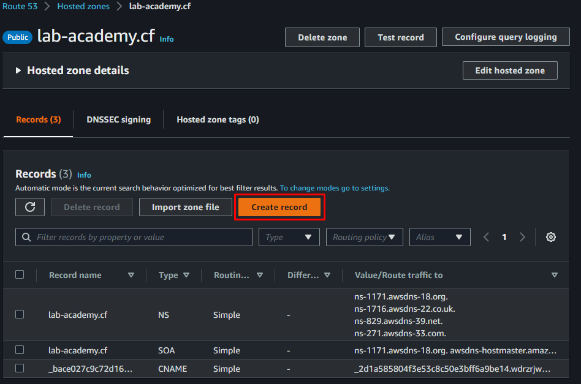
\
\
Na criação do registro, deixe o campo `Record name` vazio, em `Record type` selecione o tipo "A - Routes traffic to an IP address and some AWS resources", marque a opção `Alias`, em `Route traffic to` selecione "Alias to CloudFront distribution" e informe a distribuição do CloudFront que criamos no passo 6. Ao finalizar clique em `Create records`.\
\
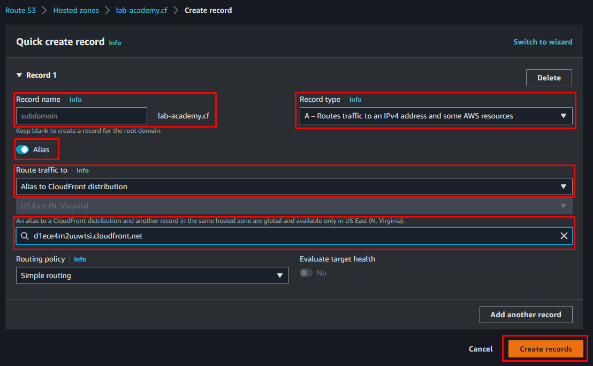
\
\
Aguarde alguns segundos para garantir que o DNS já foi propagado (geralmente é quase instantâneo), e nesse momento toda configuração necessária já foi realizada e sua aplicação já está pronta para ser testada.

### Passo 8: Vamos testar

Para nosso teste utilizaremos a URL encurtada que foi gerada la no passo 4, a URL gerada para meu exemplo foi `https://lab-academy.cf/5n6w2i7f`.\
\
Vamos abrir essa URL em um browser, o resultado esperado é que automaticamente sejamos redirecionados para a URL original, no meu caso `https://cloudfaster.com.br/blog/dicas-para-aprovacao-no-exame-aws-certified-cloud-practitioner`.\
\
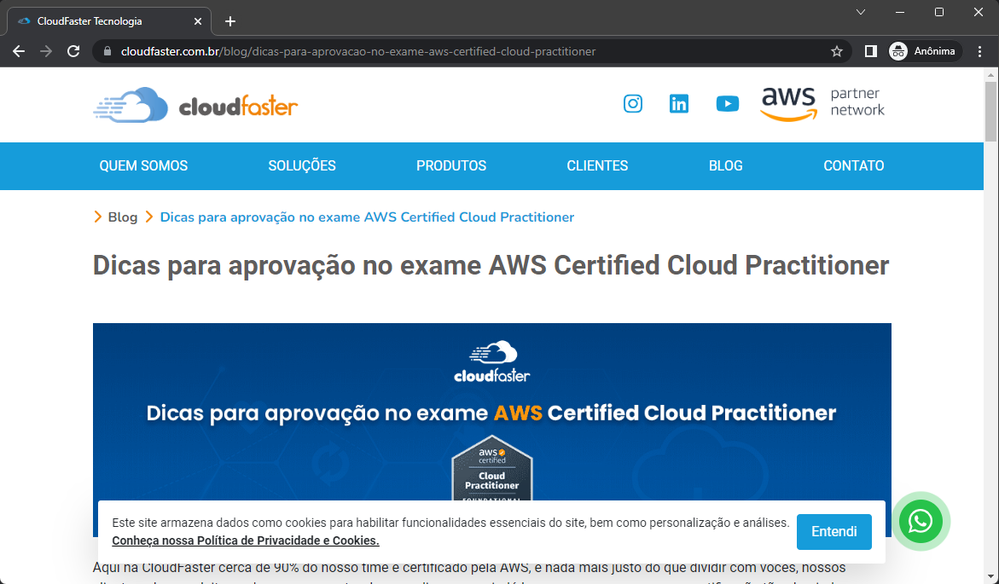
\
\
It's Works!!!

### Extra class

Como vimos, tudo funciona perfeitamente, mas vamos um outro desafio? Que tal subir um documento para um bucket S3 privado, e compartilhar ele com uma URL encurtada?\
\
A ideia aqui é que o objeto gravado ganhe uma URL pré-assinada do S3 e seja compartilhada pelo período de tempo que foi definido na hora de gerar a URL encurtada...\
\
Vamos ver como funciona?\
\
Primeiro temos que subir um objeto para o S3, podemos utilizar o bucket privado que criamos no tutorial ou você pode criar um bucket qualquer dentro da mesma conta AWS.\
\
Acesse o S3 (<https://s3.console.aws.amazon.com/s3/buckets>), selecione o bucket de sua preferência, na tela aberta clique em `Upload`.\
\
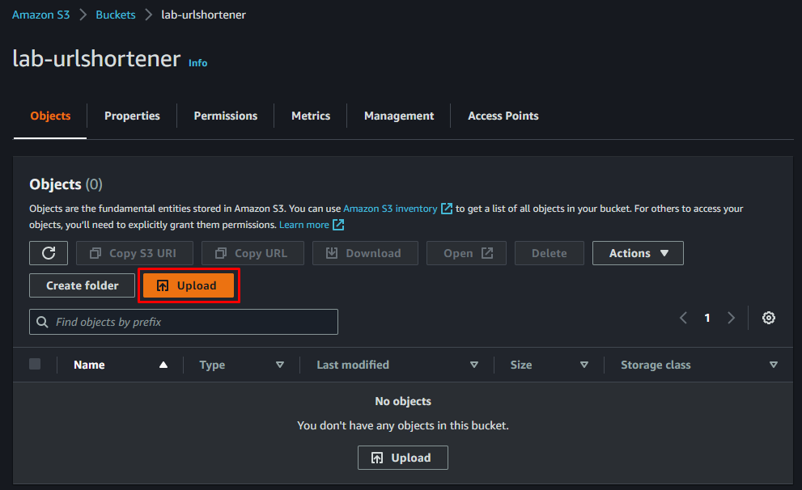
\
\
Agora clique em `Add files`, selecione o arquivo de sua preferência, neste repositório deixei um preparado que iremos utilizar, está diponível em [documento/documento.pdf](https://github.com/cloudfaster-academy-workshop/lab-url-shortener/blob/main/documento/documento.pdf). Ao selecionar o arquivo, clique em `Upload`.\
\
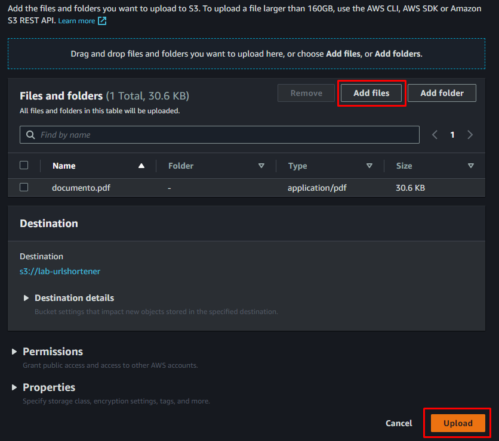
\
\
Quando o upload for concluído, clique sobre o nome do arquivo que você acabou de subir, na janela que abrir, copie a URI do S3, um teste para validar se o objeto está realmente privado é clicar no Object URL, uma mensagem de erro deverá ser exibida informando que você não tem acesso.\
\
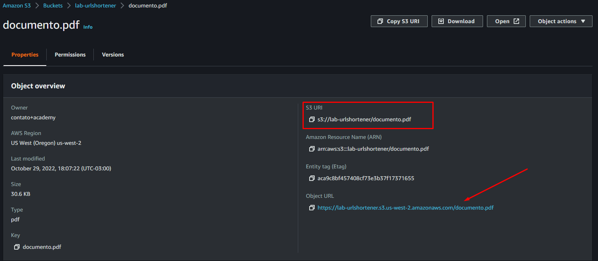
\
\
Agora vamos usar o Postman para criar a URL encurtada utlizando a função Lambda vinculada com a API Gateway que fizemos la nos passos 3 e 4.\
\
O `Body` da nossa requisição ficará algo parecido com o abaixo: (altere a url para a URI do S3 que você copiou).\

```json
{
    "url": "s3://lab-urlshortener/documento.pdf",
    "ttl": 300
}
```

Envie a requisição e copie a `urlEncurtada` que será gerada no retorno da requisição.\
\
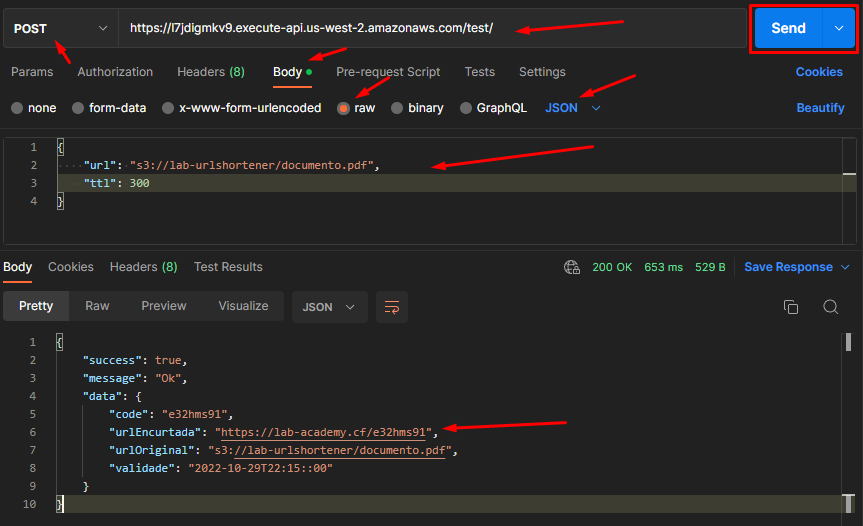
\
Abra a URL em um browser e veja o resultado!
\
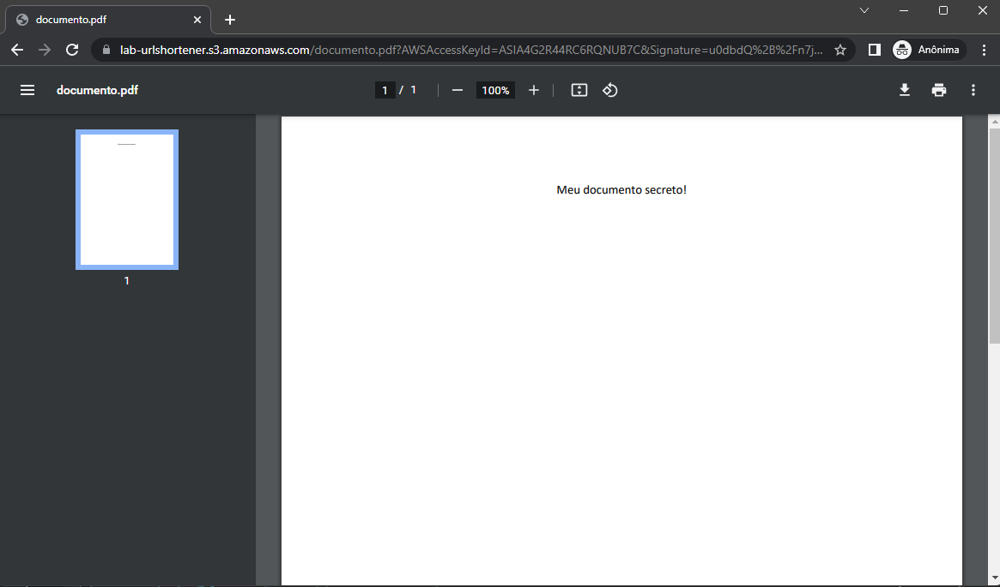
\
\
That's all folks!
